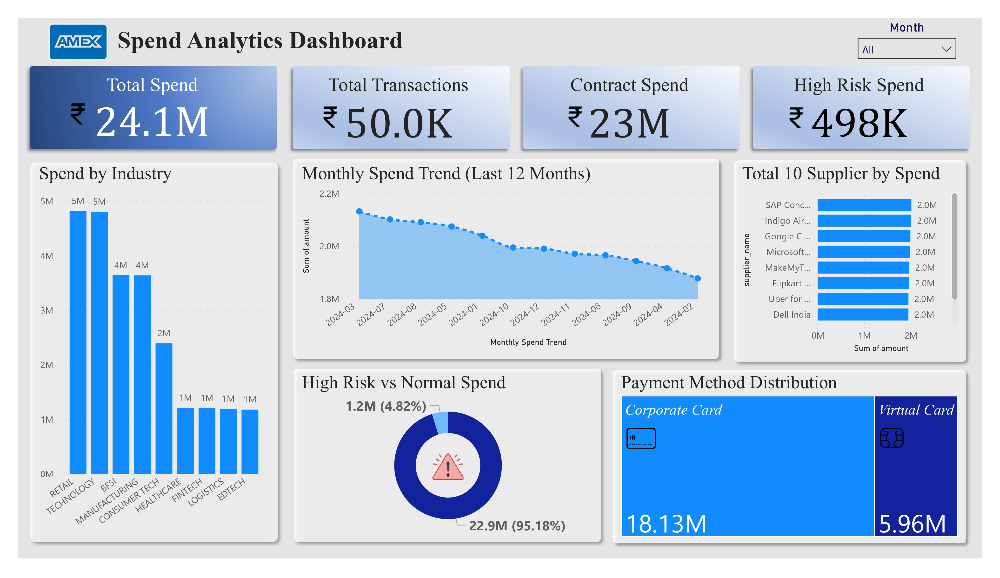

# B2B Spend Analytics & Supplier Intelligence (AmEx Inspired)

End-to-end enterprise analytics project built using **Microsoft Fabric, SQL, Python, and Power BI** to analyze corporate payments, supplier performance, contract coverage, and risk exposure.
---
## 🔍 Project Overview

This project simulates a real-world **enterprise spend analytics platform** similar to those used by companies like **American Express** to monitor and optimize corporate spending.

The solution helps business and finance teams answer critical questions such as:
- How much is the company spending overall?
- Which suppliers drive the highest spend?
- How much spend is under contract?
- What is the exposure to high-risk suppliers?
- How are spending trends changing over time?

The final output is an **executive-ready Power BI dashboard** built on a modern data architecture using Microsoft Fabric.
---
## 🎯 Business Problem

Large enterprises process thousands of corporate payment transactions every month across multiple suppliers and industries.

Typical challenges include:
- Limited visibility into total corporate spend  
- Over-dependence on a small set of suppliers  
- High non-contract spend leading to cost leakage  
- Inadequate monitoring of high-risk suppliers  
- Manual and slow reporting processes  
---
## ✅ Solution

I designed and implemented a **full analytics pipeline** that:

- Ingests raw corporate transaction, company, and supplier data  
- Cleans and enriches data using a **Bronze–Silver–Gold architecture**  
- Builds a centralized analytics model in the Gold layer  
- Delivers an interactive **executive Power BI dashboard** with:

Key Analytics:
- Total Spend & Transaction Volume  
- Spend by Industry and Supplier  
- Monthly Spend Trends  
- Contract vs Non-Contract Coverage  
- High-Risk Supplier Exposure  
- Payment Method Distribution  

This enables leadership teams to:
- Monitor financial performance  
- Improve supplier negotiations  
- Reduce procurement risk  
- Support strategic planning  
---
## 🏗️ Architecture

The project follows a modern **Lakehouse-based Medallion Architecture**:

- **Bronze Layer** – Raw ingestion of transaction, company, and supplier data  
- **Silver Layer** – Cleaned and enriched fact & dimension tables  
- **Gold Layer** – Final analytics-ready fact table and KPIs  
- **Semantic Model** – Single source of truth for reporting  
- **Power BI Dashboard** – Executive consumption layer  
---
## 📊 Dashboard Preview

### Executive Spend Analytics Dashboard

The dashboard includes:
- Executive KPI summary  
- Spend by Industry  
- Top Suppliers by Spend  
- Monthly Trend Analysis  
- Contract & Risk Distribution  
- Payment Type Insights  
---
## 💡 Sample Business Insights

- A small group of suppliers contributes a large share of total spend (supplier concentration risk)  
- Contract spend covers the majority of payments, indicating strong procurement governance  
- High-risk suppliers represent limited but strategically important exposure  
- Card-based payments dominate transaction volume  
- Certain industries consistently drive higher corporate spend  
---
## 🧰 Tools & Skills Demonstrated

- Microsoft Fabric (Lakehouse, Semantic Model)  
- SQL analytics & data modeling  
- Python & Spark transformations  
- Bronze–Silver–Gold architecture  
- Power BI dashboard design  
- KPI development & executive reporting  
- Business analytics & storytelling  
---
## 👤 Author

**Adarsh Ajit Singh**  
Target Roles: Data Analyst | Business Analyst | Reporting & Insights Analyst  

- This project uses synthetic data for demonstration purposes  
- Architecture and workflows reflect real enterprise analytics systems used in fintech and procurement analytics  
